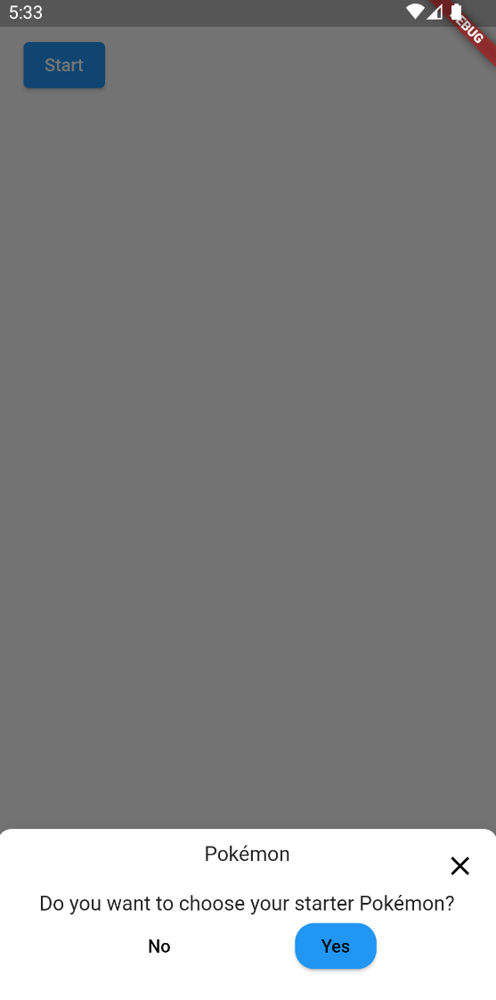

[](https://github.com/Iconica-Development) [](https://github.com/Iconica-Development/flutter_bottom_alert_dialog/actions/new) [](https://github.com/tenhobi/effective_dart) 

Bottom alert dialog widget. 

## Install

To use this package, add `bottom_alert_dialog` as a [dependency in your pubspec.yaml file](https://flutter.dev/docs/development/platform-integration/platform-channels).

## How to use

### Configure

To configure the bottom alert dialog use the ```BottomAlertDialogConfig``` inherited widget.
Make sure that ```BottomAlertDialog``` is a child of ```BottomAlertDialogConfig``` so that ```BottomAlertDialogConfig``` can be read from the build context.
To ensure that ```BottomAlertDialogConfig``` is available in the widget builder of ```showDialog()``` implement the MaterialApp builder like this:
```dart
 void main() {
  runApp(
    MaterialApp(
      home: const BottomAlertDialogDemo(),
      builder: (context, child) {
        return BottomAlertDialogConfig(
          child: child ?? const SizedBox.shrink(),
        );
      },
    ),
  );
}
``` 

### Show dialog

You can use one of the built in Flutter dialog functions to show a dialog like this:
```dart
 showDialog(
    context: context,
    builder: (context) => BottomAlertDialog.yesOrNo(
    title: const Text('Dialog'),
    body: const Text('Are you sure?'),
    onYes: () {},
    onNo: () {},
    ),
);
```

See [Example Code](example/lib/main.dart) for more info.



## Issues

Please file any issues, bugs or feature request as an issue on our [GitHub](https://github.com/Iconica-Development/flutter_bottom_alert_dialog) page. Commercial support is available if you need help with integration with your app or services. You can contact us at [support@iconica.nl](mailto:support@iconica.nl).

## Want to contribute

If you would like to contribute to the plugin (e.g. by improving the documentation, solving a bug or adding a cool new feature), please carefully review our [contribution guide](./CONTRIBUTING.md) and send us your [pull request](https://github.com/Iconica-Development/flutter_bottom_alert_dialog/pulls).

## Author

This bottom_alert_dialog for Flutter is developed by [Iconica](https://iconica.nl). You can contact us at <support@iconica.nl>